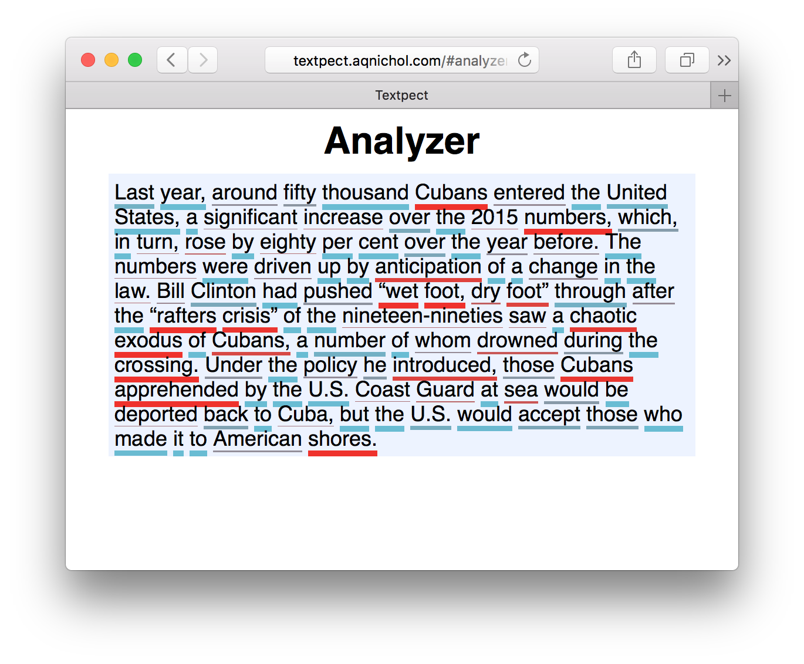

# textpect

Neural networks are good at predicting text (e.g. auto-correct). This project allows you to visualize how well a neural network predicts your text. This could be helpful: the neural network effectively tells you where readers might be confused or surprised, helping you choose better phrasing.



# Usage

You must have [Go installed](https://golang.org/doc/install). Once you do, you can run the server like so:

```
$ go get -u -d github.com/unixpickle/textpect
$ cd $GOPATH/src/github.com/unixpickle/textpect
$ go run *.go -network /path/to/network -port 8080
```

The server port number (`8080` in this example) can be changed to anything. Replace `/path/to/network` with the path of a trained language model. As of the time this was written, you can download a trained network [here](http://aqnichol.com/networks/newyorker_lstm).

Once the server is running, you can navigate to `http://localhost:8080` in your browser, being sure to replace `8080` with whatever port number you decided.
